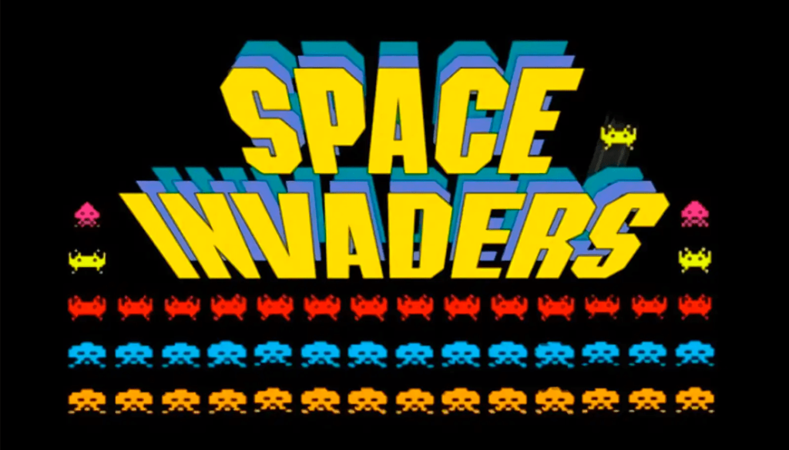
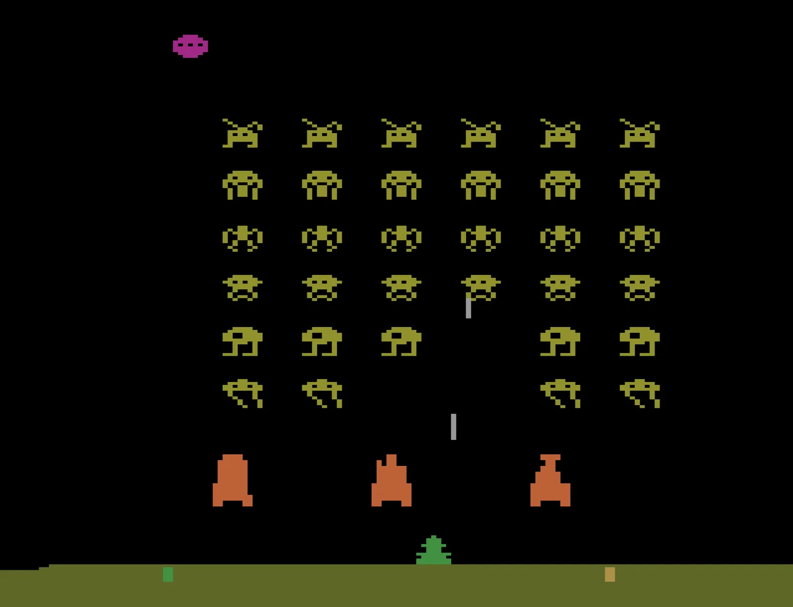
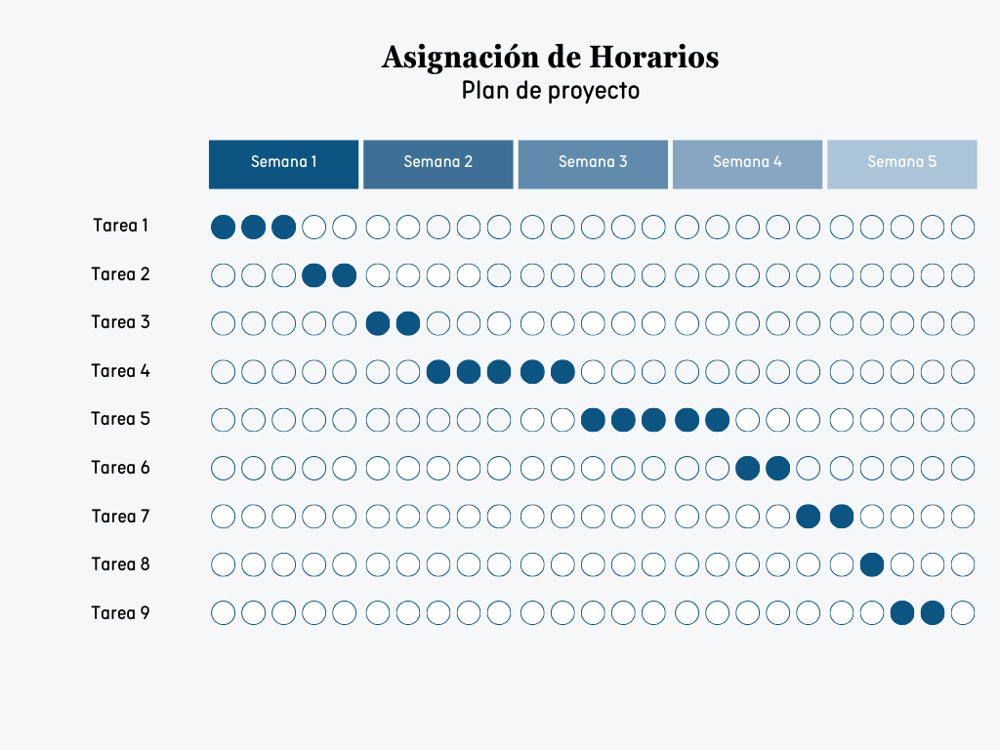

# Anteproyecto Final - IA

## Agente de Aprendizaje por Refuerzo para superar Space Invaders

## Código del proyecto: SPACEAI

## Integrantes
- Ramirez Victor
- Ruiz Joaquin

## Introducción
Space Invaders es un videojuego de disparos y arcade lanzado en 1978 por la compañía Taito. En este juego, el jugador asume el control de una nave espacial que tiene como misión defender la Tierra de oleadas de invasores alienígenas. El objetivo principal es eliminar a todos los enemigos antes de que desciendan hasta la parte inferior de la pantalla, donde se encuentra la nave del jugador.

La dinámica de juego es la siguiente: el jugador puede mover la nave de manera lateral y disparar proyectiles hacia las filas de enemigos, que avanzan en formación y aceleran su movimiento a medida que se acercan. Cada nivel se completa al destruir todas las naves alienígenas, pero si alguna llega al extremo inferior de la pantalla o si el jugador pierde todas sus vidas, el juego termina.

Los modos y dificultades de Space Invaders se distinguen por factores como la velocidad y frecuencia de los proyectiles enemigos, el aumento de la rapidez de movimiento de los invasores a medida que disminuyen en número, la reducción de vidas y defensas del jugador en niveles avanzados, y patrones de movimiento de los enemigos que se vuelven menos predecibles en niveles superiores. También se implementa una dificultad progresiva que incrementa dinámicamente la intensidad del juego con cada nivel, lo que mantiene el desafío constante para el jugador a lo largo de la partida.

## Descripción

### Desafío
En el contexto de Space Invaders, el desafío radica en la defensa del planeta Tierra contra oleadas sucesivas de alienígenas. Los jugadores deben disparar de manera precisa, mover su nave lateralmente y esquivar los proyectiles enemigos. Cada nivel presenta una formación de invasores que se desplazan hacia abajo a medida que el jugador avanza, aumentando la velocidad y dificultad a medida que se eliminan más enemigos.

La dificultad del juego radica en que velocidad de los alienígenas aumenta a medida que va progresando. Los jugadores deben gestionar sus movimientos para esquivar los disparos enemigos y a su vez eliminarlos. Además, la aparición de naves especiales que otorgan puntos extra añade una capa adicional de desafío y recompensa.

### Diseño de los Mapas de Space Invaders
Para el desarrollo de este proyecto, se crearán diferentes configuraciones dentro del entorno de Space Invaders de OpenAI Gym, cada una diseñada para evaluar distintas habilidades y estrategias del agente en cuanto a navegación y toma de decisiones. Los escenarios se estructurarán para que el agente enfrente desafíos crecientes de dificultad a medida que progresa, con el fin de optimizar su rendimiento en el contexto del juego. 	

Los escenarios se pueden editar según:

- **Dificultad:** Hay 2 dificultades, en la dificultad más baja el tamaño del agente es chico mientras que en la dificultad alta el tamaño del agente es más grande (se engrosa).
- **Modos:** El entorno cuenta con 16 modos, cada uno de ellos permite por ejemplo el movimiento de los escudos (piezas en las que puede protegerse el jugador de proyectiles enemigos) así como también velocidad y trayectoria de los proyectiles enemigos. En la documentación se denominan "flavors", ya que permiten ir cambiando la dinámica del juego.

### Objetivos
Desarrollar un agente capaz de completar niveles de Space Invaders de distintos niveles de dificultad, utilizando aprendizaje por refuerzo para aprender estrategias eficientes en el entorno de juego.

### Alcance
Este proyecto se centra en el entrenamiento de un agente en un entorno simulado de Space Invaders, con distintos niveles de dificultad y modos (flavors). El agente será entrenado utilizando algoritmos de aprendizaje por refuerzo, como Q-Learning, DQN (Deep Q-Network) o PPO (Proximal Policy Optimization), para mejorar su capacidad de esquivar disparos, destruir enemigos y maximizar su puntuación. Dado que el equipo no cuenta con GPUs dedicadas, posiblemente se opte primero por desarrollar el algoritmo de Q-Learning ya que no se utilizan redes neuronales. Se intentará utilizar DQN y/o PPO como una segunda opción, pero posiblemente sean de menor nivel para evitar costos computacionales altos.

### Recolección de Datos para el Desarrollo de los Algoritmos

La recolección de datos se llevará a cabo mediante la interacción directa del agente con el entorno de Space Invaders dentro de OpenAI Gym. Esto permitirá controlar las acciones del agente (mover la nave y disparar) y registrar su rendimiento (número de enemigos eliminados, vidas restantes, etc.) durante el proceso de entrenamiento. Los datos recolectados se utilizarán para entrenar el modelo de aprendizaje por refuerzo y mejorar la toma de decisiones del agente en niveles de dificultad progresiva.

Los datos del juego incluyen:

- **Posición de la nave del jugador:** Para controlar su movimiento lateral.
- **Estado de los enemigos:** Para que el agente aprenda a anticipar sus movimientos y gestionar las amenazas.
- **Disparos enemigos:** Para que el agente aprenda a esquivarlos y a tomar decisiones de evasión.
- **Puntuación y vidas restantes:** Para evaluar la efectividad de las estrategias del agente.

## Justificación
La aplicación de algoritmos y técnicas de inteligencia artificial en el proyecto de Space Invaders se justifica por la complejidad y naturaleza dinámica del entorno de juego, donde el agente debe tomar decisiones rápidas y precisas para evitar los disparos enemigos y destruir las oleadas de invasores. A través del uso de técnicas como el aprendizaje por refuerzo, es posible entrenar un modelo que aprenda a optimizar sus movimientos y su estrategia de disparo en función de la situación, adaptándose a las diferentes formaciones de enemigos y patrones de ataque.

### Planificación del Agente Baseline
Se implementará un agente heurístico  que se basa en las siguientes reglas para la toma de decisiones en el entorno de Space Invaders:

- Detección y Disparo a Enemigos: El agente dispara cada vez que hay un enemigo alineado verticalmente con la posición actual de la nave. Esta regla busca maximizar la eficiencia de los disparos sin desperdiciar municiones en posiciones no alineadas con los enemigos.
- Evasión de Proyectiles: Para evitar colisiones con los proyectiles enemigos, el agente se mueve horizontalmente cuando detecta que hay un proyectil en su misma columna y en una proximidad que represente una amenaza.

### Limitaciones
- **Tiempo de entrenamiento:** Dado que el aprendizaje por refuerzo es computacionalmente costoso, es posible que el entrenamiento se limite a pocos episodios por cuestión de recursos computacionales.

### Métricas
- **Puntuación obtenida:** La puntuación promedio del agente en cada episodio, que mide su capacidad para eliminar enemigos y completar niveles.
- **Porcentaje de éxito:** Porcentaje de episodios en los que el agente completa el nivel sin perder todas las vidas disponibles.
- **Tiempo:** Tiempo promedio en que el agente logra pasar el nivel.

## Listado de Actividades a Realizar

1. Investigación sobre Aprendizaje por Refuerzo (3 días)

- Revisar literatura sobre algoritmos de aprendizaje por refuerzo, especialmente DQN y Q-Learning.
- Estudiar ejemplos y aplicaciones previas en entornos similares, particularmente en Space Invaders.

2. Configuración del entorno de desarrollo (2 día)

- Investigar sobre el entorno de Atari ALE (Arcade Learning Environment).
- Instalar las herramientas necesarias (OpenAI Gym, bibliotecas de IA).
- Configurar el entorno de Space Invaders en OpenAI Gym para permitir la interacción con el agente.

3. Definición de los escenarios de Space Invaders (1 día)

- Ajustar los parámetros de dificultad del juego, como la cantidad de enemigos, velocidad de movimiento y frecuencia de disparos enemigos.

4. Implementación del algoritmo de Aprendizaje por Refuerzo (5 días)

- Codificar el algoritmo de aprendizaje por refuerzo elegido (DQN y Q-Learning).
- Integrar el algoritmo con el entorno de Space Invaders en OpenAI Gym.

5. Entrenamiento del agente (10 días)

- Ejecutar múltiples episodios de entrenamiento, permitiendo al agente aprender a través de la experiencia.
- Monitorizar el progreso del agente y ajustar parámetros según sea necesario, como las tasas de aprendizaje y las recompensas por eliminar enemigos o evitar disparos.

6. Evaluación y ajuste del modelo (5 días)

- Evaluar el rendimiento del agente utilizando las métricas definidas (puntuación, número de muertes, éxito, etc.).
- Realizar ajustes en el algoritmo, la función de recompensa y los parámetros de entrenamiento para mejorar el rendimiento del agente.

7. Documentación del proceso (7 días)

- Documentar cada etapa del desarrollo, incluyendo decisiones de diseño y resultados de pruebas.
- Preparar un informe final que incluya la justificación, metodología, métricas y conclusiones del proyecto.

8. Preparación de presentaciones (3 días)

- Crear una presentación que resuma el proyecto, los objetivos, el enfoque y los resultados obtenidos.
- Practicar la presentación para asegurar una comunicación clara y efectiva.

9. Revisión y correcciones finales (3 días)

- Revisar toda la documentación y el código para corregir errores y mejorar la claridad.
- Asegurarse de que toda la información esté completa y lista para la entrega final.

Tiempo Total Estimado: 28 días

## Referencias
- https://ale.farama.org
- https://www.gymlibrary.dev
- https://atariage.com/manual_html_page.php?SoftwareLabelID=460
- https://www.gymlibrary.dev/environments/atari/space_invaders/
- https://jair.org/index.php/jair/article/view/11182/26388 (Sección 7.4.1)