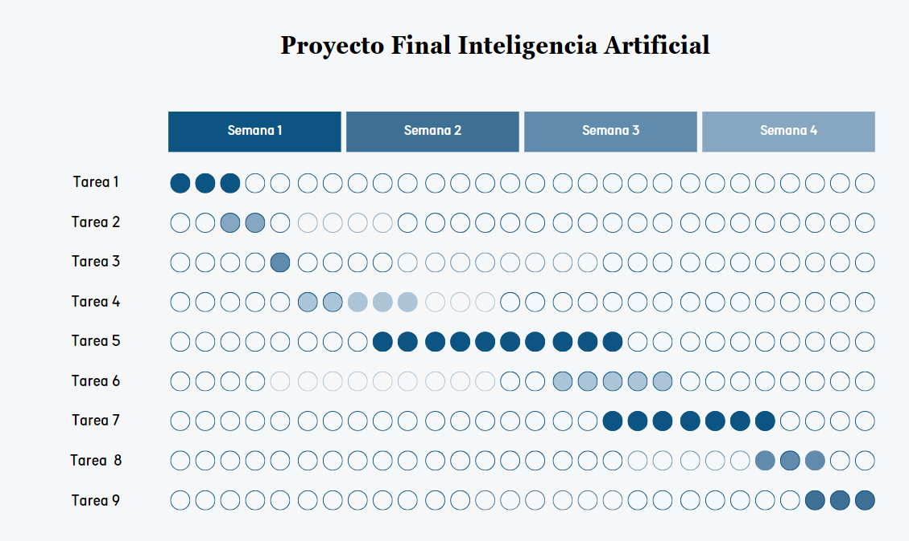

# Anteproyecto Final - IA

## Agente de Aprendizaje por Refuerzo para Desafíos de Parkour en Minecraft

## Código del proyecto: JUMPCRAFT

## Integrantes
- Ramirez Victor
- Ruiz Joaquin

## Introducción
Minecraft es un videojuego de construcción y aventura lanzado oficialmente por Mojang Studios en 2011. Se desarrolla en un mundo abierto en 3D, compuesto por bloques, donde los jugadores pueden explorar, recolectar recursos, construir estructuras y sobrevivir en diversos entornos. El juego ofrece varios modos, incluyendo el Modo Supervivencia, en el que los jugadores deben gestionar su salud y recursos para sobrevivir a criaturas del juego, y el Modo Creativo, que proporciona acceso ilimitado a materiales y la capacidad de volar.

Dentro del mundo de Minecraft, los jugadores pueden encontrar diferentes biomas, como bosques, desiertos y montañas, cada uno con sus propios recursos y desafíos. El juego incluye mecánicas de minería, agricultura y caza, permitiendo a los jugadores crear herramientas y construir refugios para protegerse de los enemigos. Además, pueden interactuar con NPCs (personajes no jugables), crear aldeas y hasta explorar estructuras generadas aleatoriamente, como templos y aldeas. Los jugadores son libres de desplazarse por su entorno y modificarlo mediante la creación, recolección y transporte de los bloques que componen al juego, los cuales solo pueden ser colocados respetando la rejilla fija del juego.

## Descripción

### Desafío
En el contexto de Minecraft, el parkour se refiere a un estilo de juego que implica el uso de saltos y movimientos para superar obstáculos y recorrer mapas diseñados específicamente para este propósito. Los jugadores crean o juegan en niveles que desafían sus habilidades de control del personaje, utilizando técnicas de salto preciso, escalada y equilibrio para navegar a través de plataformas, muros y otros elementos del entorno.

Los mapas de parkour en Minecraft pueden variar en dificultad y complejidad, desde recorridos simples que solo requieren saltos básicos, hasta desafíos avanzados que implican saltos de gran precisión, cambios de dirección rápidos y el uso de mecánicas especiales, como bloques de slime o pistones.

### Diseño de los Mapas de Parkour

Para el desarrollo de este proyecto, se crearán varios mapas de parkour en Minecraft, cada uno con características específicas de dificultad y obstáculos para entrenar al agente. Los mapas estarán diseñados para evaluar diferentes aspectos de movilidad y precisión en los saltos, así como la capacidad del agente para adaptarse a distintos desafíos de navegación. Los escenarios incluirán:

- **Niveles básicos:** Mapas con plataformas grandes y pocas variaciones en altura, destinados a que el agente aprenda movimientos básicos y nociones de salto sin obstáculos complejos.
  
- **Niveles intermedios:** Estos mapas incrementarán la complejidad con plataformas más pequeñas y mayor variedad de alturas. También incluirán obstáculos que requerirán que el agente realice saltos diagonales o cambios rápidos de dirección.

- **Niveles avanzados:** Mapas con plataformas pequeñas, saltos de precisión y obstáculos como bloques de slime o pistones que impulsarán al agente en distintas direcciones, simulando los niveles de mayor dificultad en desafíos de parkour reales.

### Objetivos
Desarrollar un agente capaz de completar trayectorias de parkour de distintos niveles de dificultad, utilizando aprendizaje por refuerzo para aprender movimientos eficientes en el entorno de Minecraft.

### Alcance
Este proyecto se centra en la capacitación de un agente en niveles de parkour diseñados en Minecraft, los cuales varían en dificultad y tipo de obstáculos. La capacitación se hará en un entorno simulado, utilizando algoritmos de aprendizaje por refuerzo como Q-Learning, DQN (Deep Q-Network) o PPO (Proximal Policy Optimization).

### Recolección de Datos para el Desarrollo de los Algoritmos

La recolección de datos se llevará a cabo mediante una combinación de **mods** y **plugins** en el entorno de Minecraft. Esta estrategia permitirá controlar los movimientos del agente y registrar su rendimiento durante el proceso de entrenamiento.

#### **Uso de Mods**

El **mod** será responsable de controlar al agente dentro del juego, permitiéndole realizar acciones como moverse y saltar en los niveles de parkour. Además, el mod registrará en tiempo real:

- **Movimientos y acciones** del agente.
- **Recompensas** obtenidas después de cada acción.
- **Estado del entorno** (por ejemplo, si el agente está en una plataforma o ha caído).

Estos datos se utilizarán para entrenar el algoritmo de aprendizaje por refuerzo (como Q-learning), permitiendo que el agente aprenda de sus errores y mejore sus decisiones.

#### **Uso de Plugins**

Los **plugins** estarán instalados en el servidor de Minecraft y permitirán:

- **Monitorear tiempos de completado** y **fallos** del agente.
- **Registrar estadísticas** sobre el rendimiento, como número de caídas y movimientos exitosos.
- **Almacenar y exportar los datos** para su posterior análisis y ajuste del algoritmo.

#### **Integración de Mods y Plugins**

La combinación de ambos permitirá recolectar datos tanto de los movimientos del agente como de su rendimiento en los niveles de parkour, lo que facilitará la optimización del algoritmo de aprendizaje por refuerzo.

## Justificación
La aplicación de algoritmos y técnicas de inteligencia artificial en el proyecto se justifica por la complejidad y la naturaleza dinámica del entorno del juego, donde los movimientos del jugador y la superación de obstáculos requieren decisiones rápidas y precisas. A través del uso de técnicas como el aprendizaje por refuerzo, es posible entrenar un modelo para que aprenda a optimizar sus movimientos y rutas, adaptándose a diferentes escenarios y desafíos en tiempo real. Esto permite desarrollar un agente que no solo mejora su rendimiento mediante la experiencia, sino que también puede enfrentar situaciones que son difíciles de resolver mediante enfoques tradicionales, como la programación de rutas fijas.

### Planificación del Agente Baseline con Movimientos Ponderados
Se diseñará un agente baseline que empleará movimientos aleatorios, pero con probabilidades ajustadas para favorecer acciones que lo acerquen a la meta y le permitan realizar saltos en ubicaciones estratégicas. Este enfoque permitirá que el agente logre avances básicos en los niveles de parkour, aunque sin incorporar optimización ni aprendizaje dinámico. Para esto, se calibrarán los pesos en las probabilidades de sus movimientos, incrementando la probabilidad de ejecutar acciones “útiles”, como saltar en plataformas específicas, en lugar de realizar movimientos sin un propósito claro.

### Limitaciones
- **Tiempo de entrenamiento:** Dado que el aprendizaje por refuerzo es computacionalmente costoso, es posible que el entrenamiento se limite a pocos episodios por cuestión de recursos computacionales.

### Métricas
- **Tiempo de completado:** El tiempo promedio que el agente tarda en completar cada trayecto de parkour.
- **Número de intentos fallidos (caídas):** La cantidad de veces que el agente cae o falla en completar el trayecto antes de alcanzar el estado objetivo.
- **Progresión del agente (porcentaje de éxito):** Porcentaje de intentos en los que el agente alcanza el objetivo final, comparado con el total de intentos.

## Listado de Actividades a Realizar

1. **Investigación sobre Aprendizaje por Refuerzo (3 días)**
   - Revisar literatura sobre algoritmos de aprendizaje por refuerzo, especialmente DQN y Q-Learning.
   - Estudiar ejemplos y aplicaciones previas en entornos similares.

2. **Configuración del entorno de desarrollo (2 día)**
   - Instalar las herramientas necesarias (Minecraft, bibliotecas de IA, entornos de simulación).
   - Configurar el entorno de desarrollo, asegurando que el agente pueda interactuar con Minecraft.

3. **Definición de los escenarios de parkour en Minecraft (2 días)**
   - Diseñar y construir niveles de parkour con diferentes niveles de dificultad en Minecraft.

4. **Implementación del algoritmo de Aprendizaje por Refuerzo (5 días)**
   - Codificar el algoritmo de aprendizaje por refuerzo elegido (DQN y Q-Learning).
   - Integrar el algoritmo con el entorno de Minecraft.

5. **Entrenamiento del agente (5 días)**
   - Ejecutar múltiples episodios de entrenamiento, permitiendo al agente aprender a través de la experiencia.
   - Monitorizar el progreso del agente y ajustar parámetros según sea necesario.

6. **Evaluación y ajuste del modelo (2 días)**
   - Evaluar el rendimiento del agente utilizando las métricas definidas.
   - Realizar ajustes en el algoritmo, la función de recompensa y los parámetros de entrenamiento para mejorar el rendimiento.

7. **Documentación del proceso (2 días)**
   - Documentar cada etapa del desarrollo, incluyendo decisiones de diseño y resultados de pruebas.
   - Preparar un informe final que incluya la justificación, metodología, métricas y conclusiones del proyecto.

8. **Preparación de presentaciones (1 días)**
   - Crear una presentación que resuma el proyecto, los objetivos, el enfoque y los resultados.
   - Practicar la presentación para asegurar una comunicación clara y efectiva.

9. **Revisión y correcciones finales (2 días)**
    - Revisar toda la documentación y el código para corregir errores y mejorar la claridad.
    - Asegurarse de que toda la información esté completa y lista para la entrega final.

**Tiempo Total Estimado: 24 días**

## Referencias
- https://towardsdatascience.com/create-a-bot-to-find-diamonds-in-minecraft-d836606a993a

- https://dohyeongkim.medium.com/deep-q-learning-from-demonstrations-dqfd-for-minecraft-tutorial-1-4b462a18de5a