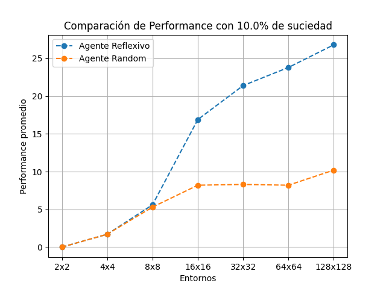
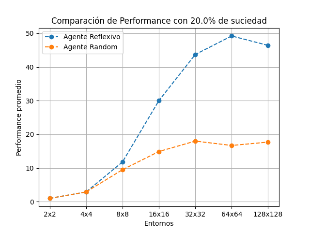
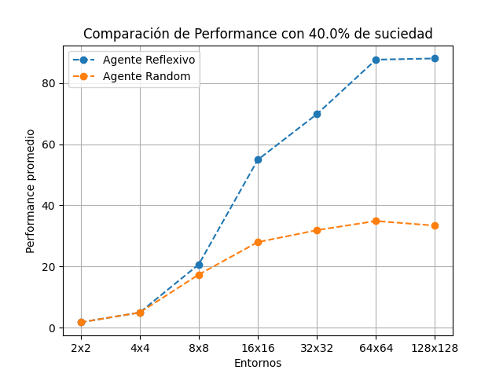
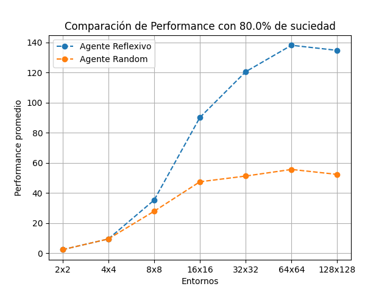
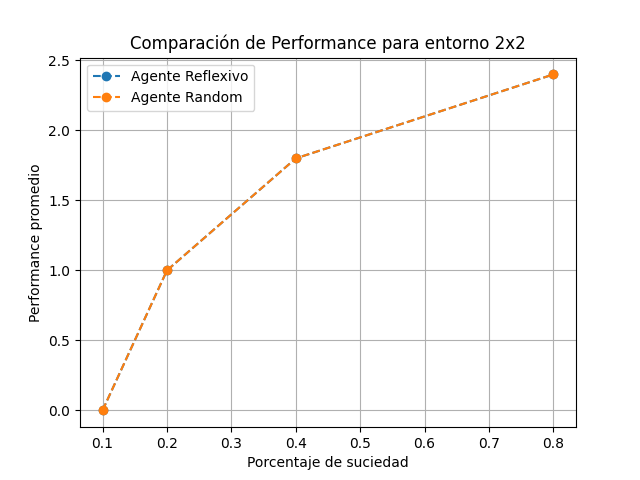
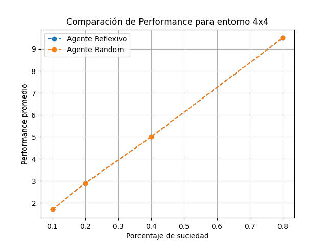
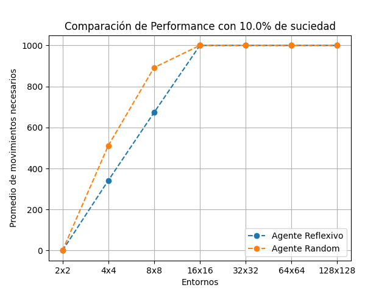
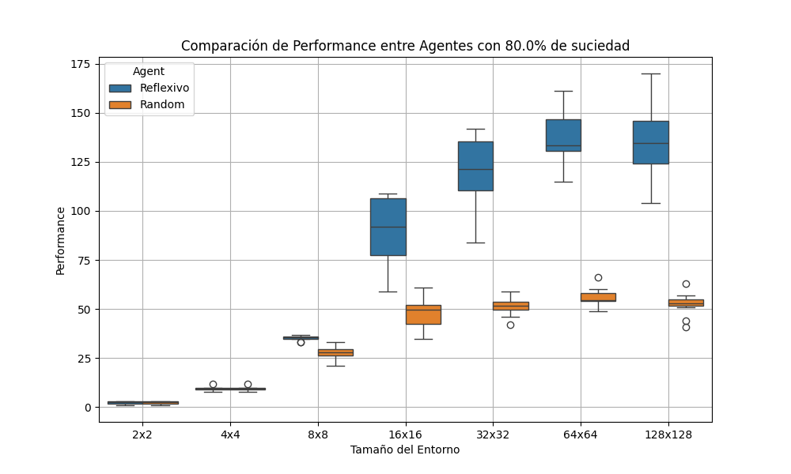

# Comparación Agente Reflexivo Simple vs Agente Random
## Introducción 
En el presente informe se realizó una comparación del rendimiento del agente reflexivo simple vs agente random, esta comparación se realizo con las siguientes características:
- **Entornos**: 2x2, 4x4, 8x8, 16x16, 32x32, 64x64, 128x128
- **Porcentajes de suciedad**: 0.1, 0.2, 0.4, 0.8

Se realizaron un total de 10 pruebas para cada combinación de entorno-suciedad y ambos agentes trabajaron sobre el mismo entorno generado aleatoriamente en cada caso.

## Marco Teórico
Para la realización del ejercicio se utilizaron entornos con las siguientes características:
- Se generan las casillas con suciedad de forma aleatoria.
- La suciedad no se regenera una vez limpiada.
- Los agentes comienzan en un casillero aleatorio del entorno.

Los agentes se dividen en dos tipos:
- **Agente random o aleatorio**: Este tipo de agente realiza una acción de manera aleatoria, sin verificar si el casillero donde se encuentra esta sucio.
- **Agente reflexivo simple**: Similar al agente aleatorio, pero tiene un sensor que le indica si la casilla donde se encuentra esta sucia o no. En caso de estar sucia realiza la acción de limpiar, sino, se mueve de forma aleatoria.

Estos agentes pueden realizar las siguientes acciones:
- Moverse en 4 direcciones (Arriba,Abajo,Izquierda,Derecha).
- Quedarse quieto.
- Limpiar una casilla.
- Utilizar el sensor (Solo el Agente reflexivo simple).

Solo puede realizar un total de 1000 acciones.

## Diseño experimental

Se realizaron experimentos para evaluar el rendimiento de los dos agentes en entornos de distintos tamaños  y con diferentes porcentajes de suciedad. Se probaron todas las combinaciones posibles de tamaño y suciedad, y ambos agentes fueron evaluados 10 veces en cada combinación, asegurando que se realizaran las evaluaciones en los mismos entornos.

El rendimiento de cada agente se evaluó según la cantidad de celdas limpiadas y, en caso de completar la limpieza del entorno, se registró también la cantidad de acciones realizadas. Los experimentos se llevaron a cabo en **Python**, utilizando clases para representar los entornos y los agentes. Los resultados fueron almacenados en un archivo Excel y se generaron gráficos para su análisis empleando librerías como **matplotlib**, **seaborn** y **pandas**.

## Análisis y discusión de resultados

Para el análisis, lo primero que se realizo fueron los graficos de la performance promedio de cada agente según su entorno y el porcentaje de suciedad. 

A partir de los gráficos podemos notar que la performances promedios alcanzadas por ambos agentes en los entornos 2x2 y 4x4 son iguales, pero a partir del entorno 8x8 en adelante, no importa que porcentaje de suciedad tenga el entorno, el agente reflexivo simple siempre tiene una performance promedio mucho mejor frente al agente random. 

Decidí analizar si realmente la performance en los entornos 2x2 y 4x4 son realmente iguales, para ello, analice estos entornos mas en detalle frente a todos los porcentajes de suciedad.

Como se puede apreciar, ambos agentes tiene el mismo rendimiento en estos entornos, pero eso no significa que sean igual de eficientes.

Para profundizar esta idea de que ambos agentes tienen distinto desempeño en entornos pequeños, procedí a graficar la cantidad de movimientos que le llevo a cada agente llegar a su performance máxima (en caso de haber llegado).

Como se puede observar, para el entorno 2x2, ambos llegaron a su máxima performance en 0 acciones, esto de debe a que en un entorno 2x2 con 10% de suciedad no hay casilleros sucios, pero en el caso del entorno 4x4 con 10% de suciedad vemos que al Agente reflexivo simple le toma menos de 400 acciones limpiar el entorno mientras que al Agente random le toma aproximadamente 500 acciones. Esto nos indica que por más que ambos agentes pueden limpiar el entorno, el agente reflexivo lo hace con menos cantidad de acciones.

También podemos analizar algunos casos particulares con los gráficos de cajas y extensiones

Podemos ver que para el Agente reflexivo, la caja es más amplia en los entornos más grandes, lo que nos indica una mayor variabilidad en su performance. Para el Agente Random, la caja es generalmente más pequeña y se mantiene constante, indicando que la variabilidad en su performance es baja y que su capacidad para limpiar es bastante limitada en todos los entornos.

## Conclusiones

Podemos concluir que aunque los agentes reflexivo y random tienen un rendimiento similar en entornos pequeños (2x2 y 4x4), el agente reflexivo nos muestra una clara superioridad a medida que aumenta el tamaño del entorno, sin importar el porcentaje de suciedad. En entornos grandes, el agente reflexivo además de lograr una mejor performance promedio, también lo hace con mayor eficiencia, requiriendo un número menor acciones para limpiar el entorno. Además, podemos ver que el agente reflexivo tiene una mejor capacidad de adaptación a entornos grandes en comparación con el agente random, cuya performance es más limitada y consistente.