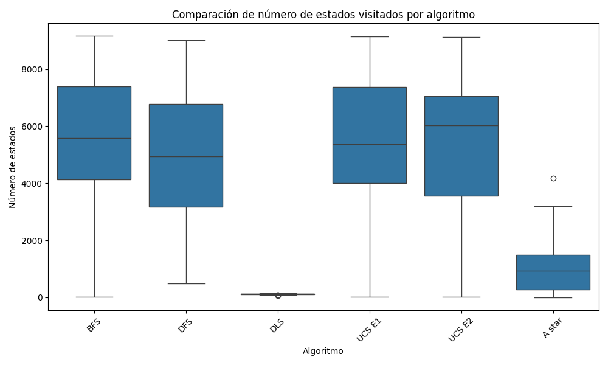
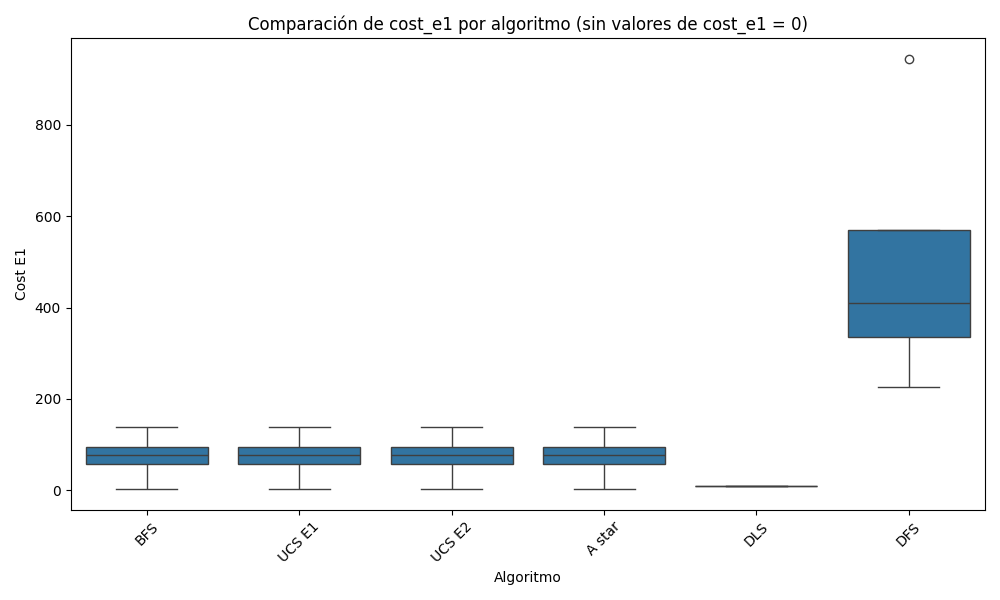
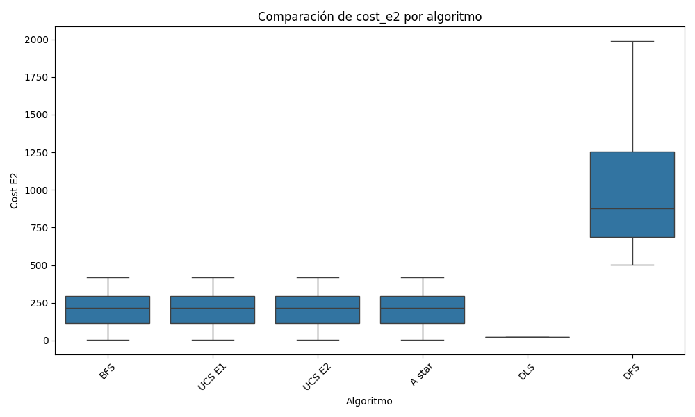
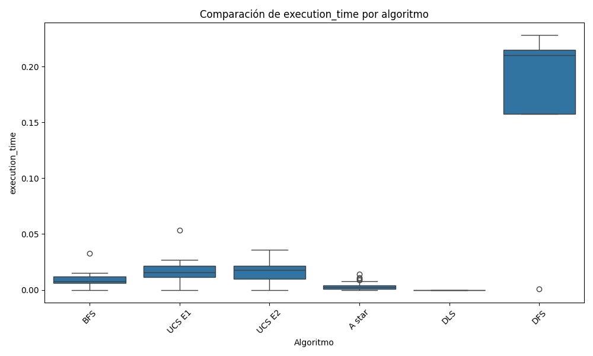
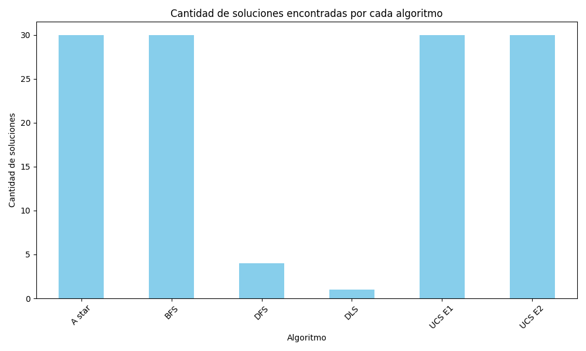

## Informe TP3 y TP4

### Introducción:
Se implementaron y evaluaron diversos algoritmos de búsqueda, tanto no informada como informada. Los algoritmos no informados utilizados fueron:

- **BFS** (Búsqueda en Anchura).
- **DFS** (Búsqueda en Profundidad).
- **DLS** (Búsqueda en Profundidad Limitada).
- **UCS** (Búsqueda de Costo Uniforme).

Para la búsqueda informada, se empleó el algoritmo A* , utilizando como heurística la distancia Manhattan.

Todos los algoritmos fueron evaluados en el entorno FrozenLake, considerando dos escenarios de costos:

1. Costo fijo por cada acción: 1.
2. Costo variable por acción, es decir, cada acción tiene un costo distinto.

### Marco teórico:
El entorno seleccionado para la ejecución de los algoritmos fue FrozenLake-v1 de la librería Gymnasium en Python. Este entorno simula un lago congelado representado por una cuadrícula de tamaño N x N. En la superficie del lago hay agujeros que actúan como obstáculos para el agente. El agente y el objetivo son colocados aleatoriamente en la cuadrícula, además se deshabilitó la opción "is_slippery" en el entorno para su correcta comparación.

El agente tiene la capacidad de moverse en cuatro direcciones: izquierda, abajo, derecha y arriba, las cuales se representan numéricamente de 0 a 3, respectivamente. El objetivo principal del agente es encontrar un camino que lo lleve desde su posición inicial hasta el objetivo.

En cuanto a los escenarios de costos:

En el primer escenario, todas las acciones tienen un costo uniforme de 1.
En el segundo escenario, el costo de cada movimiento depende de la dirección tomada:
- Izquierda: costo 1.
- Abajo: costo 2.
- Derecha: costo 3.
- Arriba: costo 4.

### Diseño experimental:
En los experimentos, se ejecutaron los algoritmos en *30* entornos generados de manera aleatoria de tamaño *100 x 100* y con una probabilidad de agujeros del *8%*. Cada entorno fue evaluado de manera consistente, permitiendo analizar el desempeño de cada algoritmo bajo las mismas condiciones. De esta forma, se pudo observar cómo se comportaban los algoritmos al enfrentar los mismos desafíos, garantizando una comparación justa entre ellos.

- BFS (Búsqueda en Anchura): Este algoritmo comienza en el punto de inicio y expande los nodos frontera nivel por nivel, explorando primero aquellos más cercanos al punto de partida.

- DFS (Búsqueda en Profundidad): Al igual que BFS, comienza en el punto inicial, pero prioriza siempre el nodo a la izquierda al realizar la expansión, explorando en profundidad.

- DLS (Búsqueda en Profundidad Limitada): Este algoritmo es una variante del DFS, pero limita la profundidad de la exploración a un valor predefinido. Para este experimento, se limitó la profundidad a 10.

- UCS (Búsqueda de Costo Uniforme): Prioriza la expansión de los nodos con menor costo acumulado. Se probó en dos escenarios diferentes: en el primero, el costo de las acciones es 1, y en el segundo, el costo es variable (mencionado anteriormente).

- A*: Similar a UCS, pero utiliza una heurística para mejorar la eficiencia de la búsqueda. La heurística consistió en combinar la distancia Manhattan con el costo de realizar cada acción.

### Análisis y discusión de resultados

#### Análisis de estados
Comenzamos el análisis comparando la cantidad de estados que explora cada algoritmo.

En el gráfico podemos observar que la mayoría de los algoritmos exploran una cantidad similar de estados. Sin embargo, el algoritmo A* destaca por visitar significativamente menos estados en comparación con los demás. Además, el algoritmo DLS también explora pocos estados, lo que se debe a la limitación impuesta por la profundidad máxima de 10. No obstante, esto no garantiza que siempre logre encontrar la solución.

#### Análisis costos
A continuación, analizamos el costo de los movimientos en los dos entornos, enfocándonos solo en los casos donde se haya encontrado una solución en un máximo de 1000 acciones.

Como se puede ver, el algoritmo DFS muestra el peor rendimiento independientemente del costo de sus acciones, ya que la solución que encuentra no es óptima. En contraste, los algoritmos BFS, UCS y A* logran encontrar la solución óptima. También podemos notar que el costo del algoritmo DLS es muy bajo, lo cual se explica porque solo puede realizar un máximo de 10 movimientos para hallar el camino.

#### Análisis de tiempos

En el gráfico, se destaca que el algoritmo A* consume significativamente menos tiempo que los demás. Esto se debe a que, al ser un algoritmo de búsqueda informada, explora una menor cantidad de estados. El algoritmo DLS también muestra un tiempo de ejecución reducido y explora pocos estados, pero esto no implica necesariamente que sea superior. A continuación, profundizaremos en esta cuestión.

#### Análisis de soluciones encontradas

A partir de este gráfico, podemos concluir que aunque el algoritmo DLS explora menos estados y consume menos tiempo que otros, esto no lo convierte en el mejor, ya que encuentra la solución en muy pocas ocasiones debido a su limitación de profundidad de 10. Algo similar ocurre con el algoritmo DFS, que consume mucho más tiempo y presenta un mayor costo de acciones. Además, DFS encuentra la solución en un número reducido de veces, ya que está limitado a un máximo de 1000 acciones para hallarla.

### Conclusión

### Conclusión

En este trabajo se implementaron y evaluaron varios algoritmos de búsqueda, tanto informada como no informada, en el entorno FrozenLake. Los algoritmos BFS, DFS, DLS, UCS y A* fueron analizados en términos de la cantidad de estados explorados, el costo de las soluciones encontradas, el tiempo de ejecución y la cantidad de veces que lograron encontrar una solución.

Los resultados muestran que A* se destaca como el algoritmo más eficiente, encontrando soluciones óptimas, consumiendo menos tiempo y explorando una menor cantidad de estados gracias a su enfoque informado. En contraste, DFS demostró ser el algoritmo menos eficiente, con mayores tiempos de ejecución, costos más altos y un bajo porcentaje de soluciones encontradas.

El algoritmo DLS, aunque consume menos tiempo y explora menos estados, está limitado por su profundidad, lo que impide que encuentre soluciones de manera consistente. Por otro lado, los algoritmos BFS y UCS ofrecen resultados más equilibrados, encontrando soluciones óptimas en la mayoría de los casos, aunque a costa de un mayor tiempo de ejecución comparado con A*.

En resumen, A* es la mejor opción cuando se busca un balance entre tiempo de ejecución y calidad de la solución, mientras que algoritmos como DFS y DLS resultan menos efectivos en escenarios con grandes limitaciones de recursos o profundidad.

