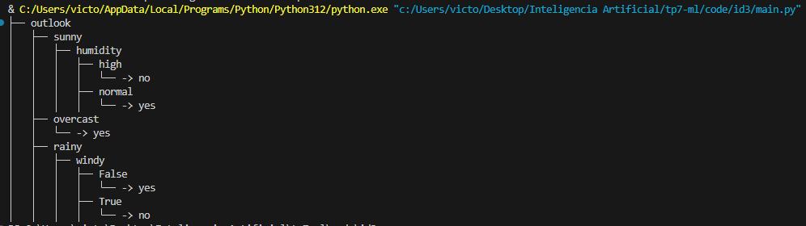

# Resultado evaluación tennis.csv

# Estrategias para Manejar Datos Continuos en Árboles de Decisión

## 1. Discretización Previa
Convierte variables continuas en categorías antes de construir el árbol.
- **Binning**: Divide los datos en intervalos de igual tamaño o según su distribución.
- **Discretización supervisada**: Crea intervalos en función de la variable objetivo, maximizando la ganancia de información.

## 2. Punto de Corte Óptimo
En lugar de discretizar, algunos algoritmos prueban diversos puntos de corte en cada nodo. El objetivo es encontrar el que maximice la ganancia de información o minimice la impureza (como en el algoritmo CART).

## 3. Divisiones Dinámicas en Cada Nodo
Ajusta los puntos de corte de forma dinámica en cada nodo, permitiendo que el valor de corte varíe según el contexto de cada nodo, optimizando así la división de datos en el árbol.

## 4. Árboles Binarios
Algoritmos como CART y C4.5 dividen los datos en dos ramas por nodo, facilitando decisiones sobre variables continuas mediante comparaciones binarias (ej. "atributo ≥ valor").

## 5. Normalización y Transformación de Datos
Los datos pueden normalizarse o transformarse (por ejemplo, mediante logaritmos) antes de utilizarlos en el árbol. Esto mejora el rendimiento en casos donde los datos tienen una escala amplia o gran variabilidad.

## Algoritmos que Manejan Datos Continuos

- **C4.5**: Este algoritmo extiende ID3, permitiendo manejar variables continuas mediante el cálculo de puntos de corte óptimos en cada nodo para maximizar la ganancia de información.
  
- **CART (Classification and Regression Trees)**: Utiliza divisiones binarias y optimiza la reducción de impureza (índice de Gini o error cuadrático) para trabajar con datos continuos en tareas de clasificación y regresión.
  
- **CHAID (Chi-squared Automatic Interaction Detection)**: Realiza divisiones usando pruebas de chi-cuadrado, ideal para segmentación de mercado y clasificación mediante intervalos supervisados que se alinean con la variable objetivo.
  
- **ID5R**: Es una versión incremental de ID3, capaz de manejar variables continuas mediante intervalos dinámicos. Resulta eficiente para datos en evolución.

Estas estrategias optimizan los árboles de decisión para trabajar con datos continuos y en diversos contextos analíticos.
